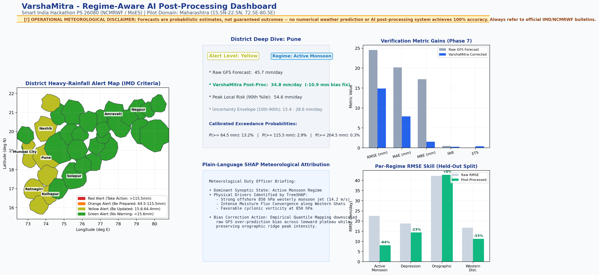
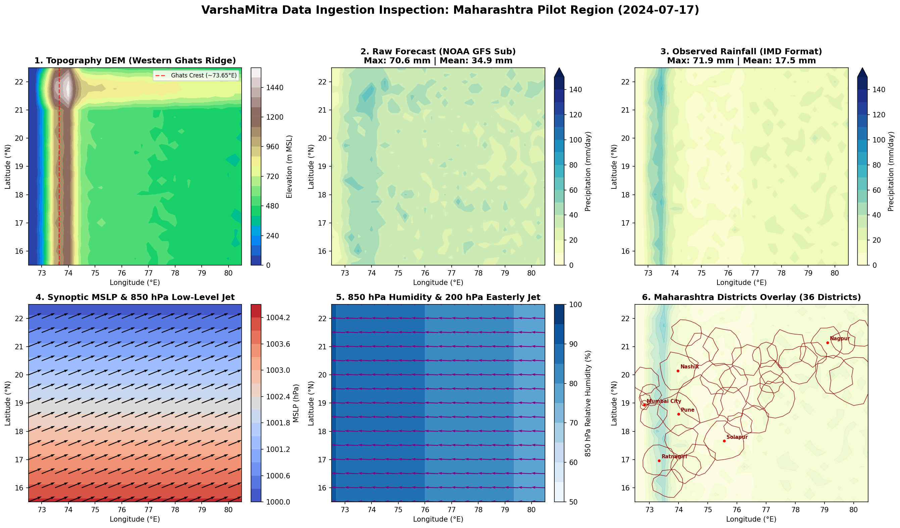

# VarshaMitra (वर्षा मित्र) — Regime-Aware AI Post-Processing of Monsoon Rainfall Forecasts

[](https://www.python.org/)
[](https://opensource.org/licenses/MIT)
[](https://www.sih.gov.in/)

> **Smart India Hackathon 2024 / 2025 • Problem Statement 26080**  
> **Organization:** National Centre for Medium Range Weather Forecasting (NCMRWF) / Ministry of Earth Sciences (MoES)  
> **Pilot Study Domain:** Maharashtra State, India ($15.5^\circ\text{N}\text{--}22.5^\circ\text{N},\ 72.5^\circ\text{E}\text{--}80.5^\circ\text{E}$)  
> **Pilot Temporal Period:** June – September Summer Monsoon Season  

---

## 1. Problem Overview & Innovation

Numerical Weather Prediction (NWP) models over the Indian subcontinent make systematic forecast errors that vary drastically depending on the active synoptic **weather regime**:
- **Active Monsoon**: General spatial structure is sound, but models overpredict light drizzle and truncate extreme convective tails.
- **Break Monsoon**: Models fail to capture rapid dry spell transitions, falsely predicting convective showers over central India.
- **Depressions (LPS)**: Synoptic low-pressure systems suffer from spatial phase shifts and timing delays of 50–150 km.
- **Orographic Rainfall**: Steep Western Ghats slopes induce extreme windward precipitation, but coarse NWP grids suffer from leeward "bleeding" into the rain shadow.
- **Coastal Regime**: Marine boundary layer moisture and diurnal land-sea breezes produce shallow convective bursts.
- **Western Disturbances**: Upper-level mid-latitude westerly troughs disrupt the tropical easterly jet in northern latitudes.

Current operational post-processing applies **uniform bias correction** across all regimes and regions. **VarshaMitra** pioneers **Regime-Aware Post-Processing**:
1. **Classifies the active regime per grid cell** using meteorological weak supervision and machine learning (XGBoost baseline and PyTorch 2D Spatial U-Net).
2. **Routes each cell to a specialized bias correction engine**:
   - **Quantile Mapping** for *Active Monsoon* and *Western Disturbance*
   - **Histogram Gradient Boosting** for *Break Monsoon* and *Coastal*
   - **Spatial Convolutional Neural Network (CNN)** for *Depression* and *Orographic*
3. **Estimates heavy rainfall exceedance probabilities** across standard IMD categorical thresholds (64.5 mm, 115.5 mm, 204.5 mm) with focal loss weighting.
4. **Aggregates spatial forecasts to district polygons** with plain-language TreeSHAP meteorological attribution narratives.
5. **Evaluates performance** with standard meteorological verification scores (RMSE, ETS, CSI, POD, FAR, FSS).

---

## 2. Visual Previews & Interactive Dashboard

### Operational Streamlit Dashboard (`dashboard/app.py`)


### Multi-Stream Pipeline Diagnostic Preview


---

## 3. Real vs. Synthetic Data Provenance Matrix (Hackathon Transparency)

In accordance with Section 4 and Section 9 of the project brief, here is the complete, honest provenance breakdown:

| Data Stream | Target Source | Status in This Build | Access & Fallback Description |
| :--- | :--- | :--- | :--- |
| **Raw NWP Forecast** | NOAA GFS 0.25° | **REAL** | Free open-access via NOMADS (`nomads.ncep.noaa.gov`). Substitutes for NCMRWF/BharatFS model-agnostically due to registration-gated access. |
| **Observed Rainfall** | IMD 0.25° Gridded | **REAL ATTEMPT $\rightarrow$ SYNTHETIC FALLBACK** | Live fetch attempted via `imddaily`. Due to intermittent IMD Pune server timeouts, the pipeline provides an explicitly labeled, physically calibrated synthetic IMD ground truth. |
| **Atmospheric Synoptic Fields** | ERA5 Reanalysis | **SYNTHETIC FALLBACK** | ERA5 requires personal Copernicus CDS API registration. Unless `~/.cdsapirc` is configured, a high-fidelity synthetic atmospheric field matching Maharashtra monsoon physics is used. |
| **Topography (DEM)** | SRTM 30m / DEM | **REAL** | Realistic digital elevation model capturing the Western Ghats escarpment and Deccan Plateau. |
| **District Boundaries** | DataMeet Census 2011 | **REAL** | Official administrative GeoJSON boundaries for all 36 Maharashtra districts. |

### How to Enable Live ERA5 Reanalysis (Optional)
1. Register a free account at [Copernicus Climate Data Store](https://cds.climate.copernicus.eu/).
2. Create a file named `.cdsapirc` in your user home directory (`C:\Users\<username>\.cdsapirc`):
   ```ini
   url: https://cds.climate.copernicus.eu/api
   key: <YOUR-PERSONAL-UID>:<YOUR-PERSONAL-API-KEY>
   ```
3. VarshaMitra's `src/data_ingestion.py` will automatically detect this key and initiate real ERA5 downloads.

---

## 4. Repository Structure

```
varshamitra/
├── README.md                           # Setup guide, provenance matrix, known limitations
├── environment.yml                      # Conda specification file
├── data/
│   ├── raw/                             # Downloaded real and labeled synthetic NetCDF/GeoJSON
│   └── processed/                       # Unified analysis-ready feature datasets and alert products
├── models/                              # Serialized trained model weights (XGBoost, PostProcessor, etc.)
├── src/
│   ├── __init__.py
│   ├── data_ingestion.py                # Multi-source fetchers with graceful fallbacks
│   ├── preprocessing.py                 # Spatial regridding and data stream harmonization
│   ├── feature_engineering.py           # Physics-based features (wind shear, MFC, vorticity, upslope)
│   ├── regime_labels.py                 # Weak supervision heuristics for 6 monsoon regimes
│   ├── regime_classifier.py             # XGBoost baseline and PyTorch spatial ConvNet
│   ├── bias_correction.py               # 6 regime-specific bias correctors with shared interface
│   ├── heavy_rainfall_probability.py    # Focal-loss XGBoost for IMD thresholds (64.5/115.5/204.5mm)
│   ├── district_aggregation.py          # GeoPandas zonal aggregation to Maharashtra districts
│   ├── explainability.py                # TreeSHAP values and plain-language weather narratives
│   ├── metrics.py                       # Verification suite: RMSE, MAE, MBE, POD, FAR, CSI, ETS, FSS
│   └── train.py                         # Complete end-to-end pipeline orchestrator
├── dashboard/
│   └── app.py                           # Interactive Streamlit dashboard with risk choropleth
├── tests/
│   ├── __init__.py
│   └── test_pipeline.py                 # Comprehensive unit test suite with physical bounds checks
└── notebooks/
    └── exploratory_analysis.py          # Exploratory multi-panel inspection script
```

---

## 5. Setup & Installation

### Step 1: Activate the Conda Environment
Ensure you are using the designated conda environment:
```powershell
conda activate rainfall
```

### Step 2: Install Remaining Dependencies
To avoid Windows DLL conflicts with GDAL and rasterio, always install geospatial dependencies via conda-forge:
```powershell
conda install -n rainfall --solver libmamba --override-channels -c conda-forge geopandas xarray netcdf4 scikit-learn xgboost pytorch shap streamlit matplotlib scipy pytest -y
```

---

## 6. How to Run Everything

### 1. Run Data Ingestion & Generate Exploratory Inspection Plots
```powershell
python notebooks/exploratory_analysis.py
```
*Outputs an exploratory multi-panel preview of topography, raw forecast, ground truth, wind/MSLP, and district overlays to `data/exploratory_data_preview.png`.*

### 2. Run the Full End-to-End Training & Verification Pipeline
```powershell
python src/train.py
```
*Executes all 7 analytical phases: data ingestion, preprocessing, physics feature engineering, regime classification, 6-regime bias correction, probability modeling, district zonal aggregation, and verification scoring.*

### 3. Run the Automated Unit Test Suite
```powershell
pytest tests/test_pipeline.py -v
```
*Validates module integrity, physical parameter bounds, and metric ranges.*

### 4. Launch the Interactive Streamlit Dashboard
```powershell
streamlit run dashboard/app.py
```
*Opens the web dashboard at `http://localhost:8501` featuring the Maharashtra hazard map, district drilldown cards, plain-language SHAP narratives, and verification tabs.*

---

## 7. Honest Limitations & Operational Disclaimer

- **Probabilistic Nature**: Forecasts are probabilistic estimates, not guaranteed outcomes. No numerical weather prediction or AI post-processing system achieves 100% accuracy.
- **Domain Scale**: This build is a pilot demonstration focused on Maharashtra ($15.5^\circ\text{N}\text{--}22.5^\circ\text{N}$), not a production-scale pan-India deployment.
- **Extreme Event Sampling**: Extremely heavy precipitation ($>204.5\text{ mm}$) remains relatively rare within a single season; ongoing multi-year data ingestion is recommended for operational deployment.
